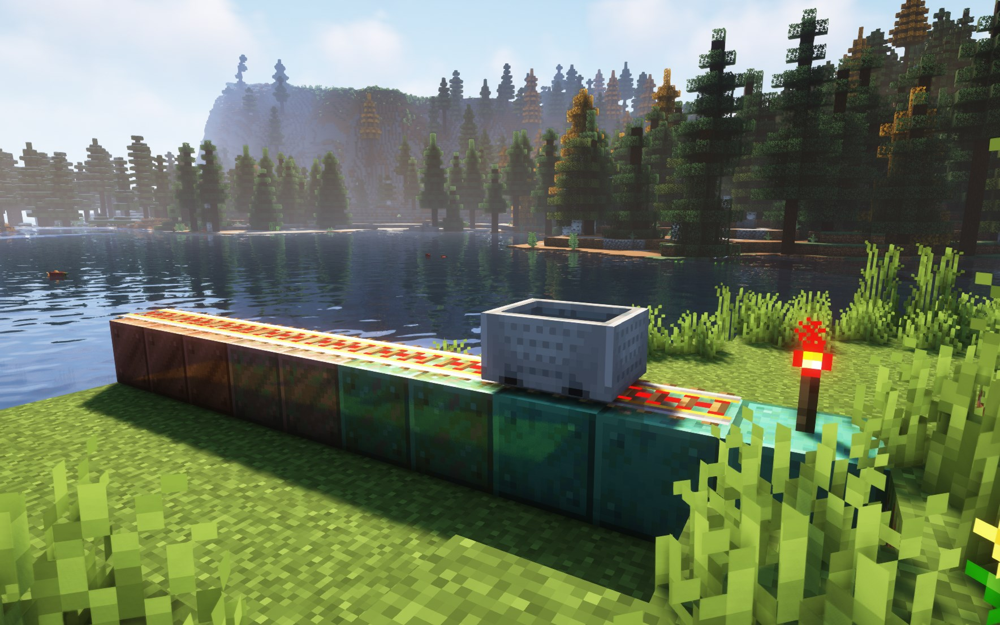

# Faster Minecarts when rails are placed on Copper Blocks

Minecarts move significantly faster when moving over rails that are placed on copper blocks. This includes normal, oxidized, exposed and weathered copper.

